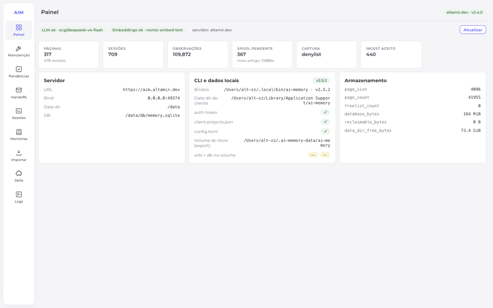
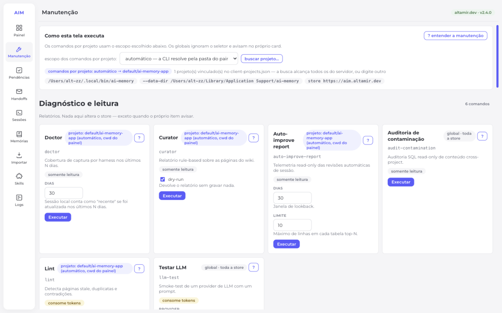
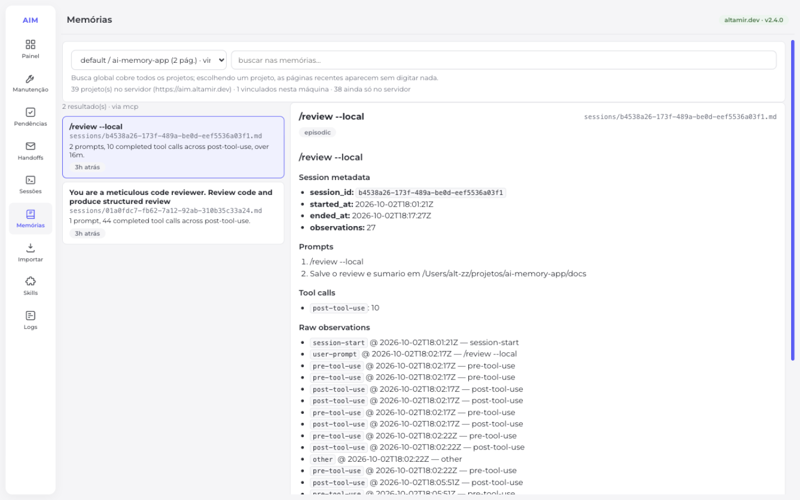
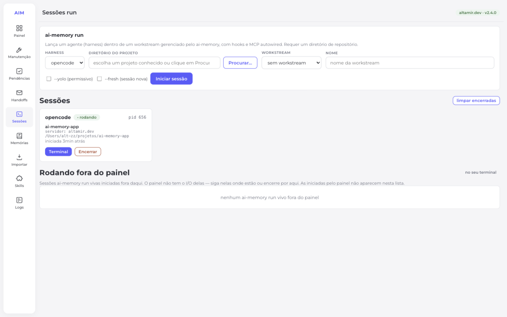
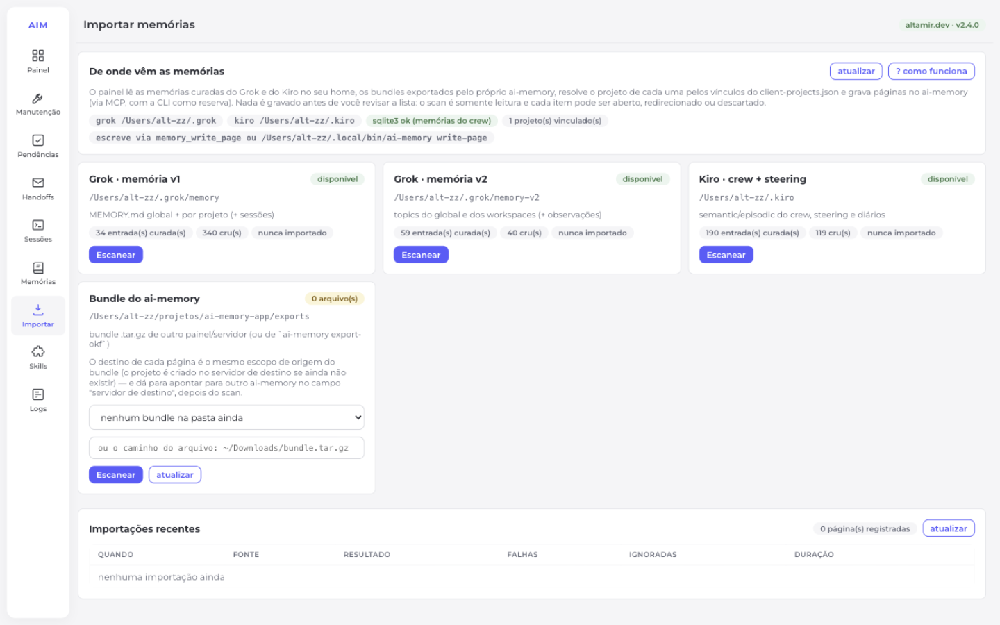
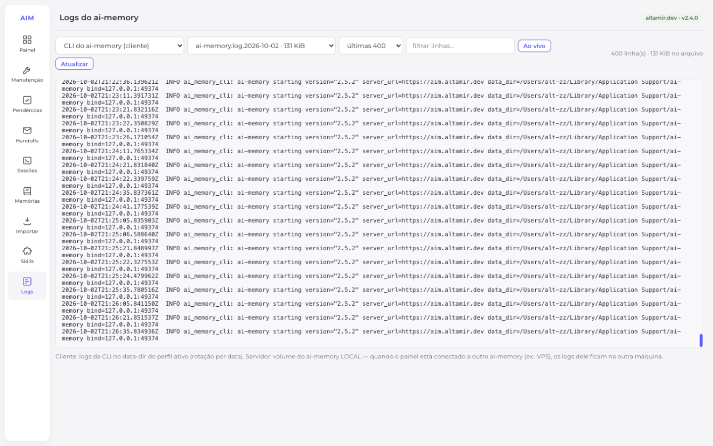
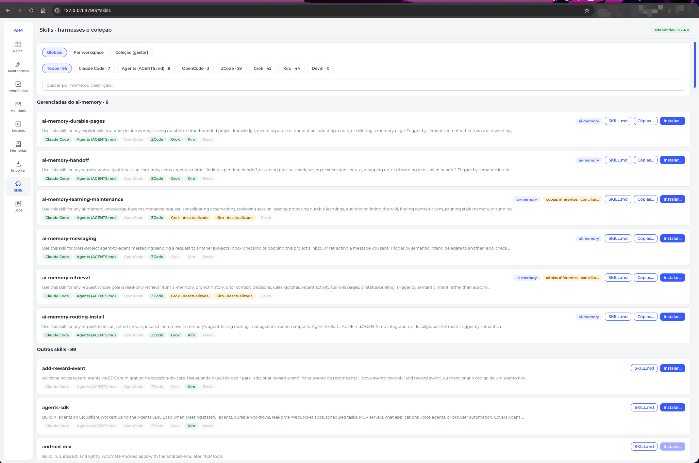
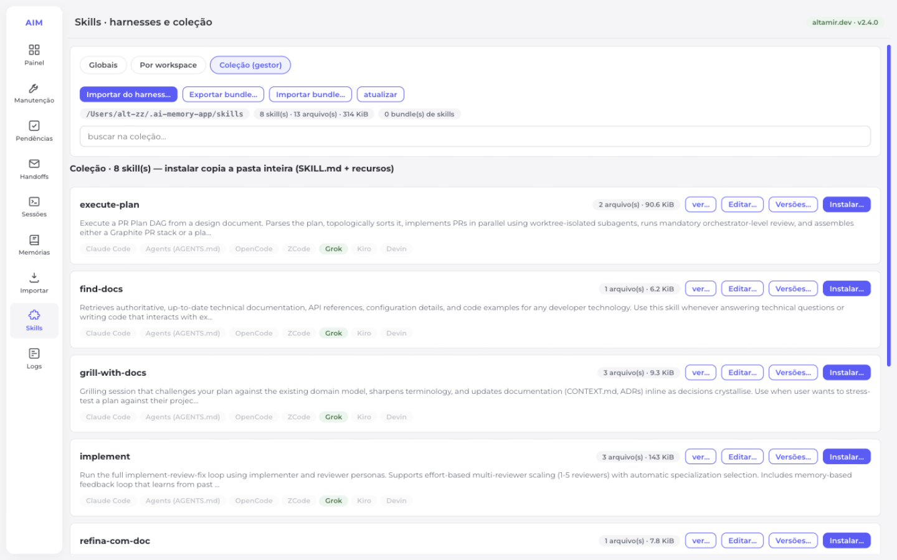

# ai-memory-app

Painel web local para gerenciar o [ai-memory](https://github.com/akitaonrails/ai-memory): status, comandos de manutenção, sessões `ai-memory run` com terminal embutido, navegação e busca nas memórias, troca de servidor, importação e exportação de bundles e gestão de Agent Skills.

Node puro, sem framework e sem build. Frontend vanilla com os tokens visuais do **zzportal** (coezzion).

## Pré-requisitos

| Precisa de | Para quê |
| --- | --- |
| **Node ≥ 22** | Rodar o painel. |
| A CLI do [ai-memory](https://github.com/akitaonrails/ai-memory) | Toda a manutenção, as sessões `run` e a leitura das memórias saem de um subprocesso dela. O painel instala a release oficial do GitHub no primeiro uso (ver abaixo), mas se você já tem uma CLI em outro lugar do PATH, o botão **usar este caminho** reaproveita em vez de instalar. |
| `sqlite3` no PATH | **Importar** memórias do Grok/Kiro e **exportar** bundles: o painel lista as páginas consultando o `memory.sqlite` com o `sqlite3` do sistema, em modo read-only. Sem ele, a importação degrada para os markdown (com aviso na tela) e a exportação fica indisponível. |
| `curl` e `tar` no PATH | Só para a instalação automática da CLI. |

O painel não sobe servidor de ai-memory: ele fala com um que já esteja rodando (Docker, `ai-memory serve` ou uma máquina remota) e é configurado no primeiro uso.

## Rodar

```bash
npm install
npm start
# abre http://127.0.0.1:4790
```

## Telas

Capturas reais do painel (as mesmas que a documentação abaixo descreve):

| Painel | Manutenção |
| --- | --- |
|  |  |
| **Memórias** | **Sessões run** |
|  |  |
| **Importar** | **Logs** |
|  |  |
| **Skills — catálogo dos harnesses** | **Skills — Coleção (gestor)** |
|  |  |

## O que tem

### Primeiro uso: preparar o painel

Numa máquina sem nada, o painel abre sozinho no **assistente de preparação** — e o chip do topo diz o que falta (`falta a CLI do ai-memory`, `servidor não responde`). A ordem é a da instalação:

1. **CLI do ai-memory** — o painel oferece instalar a partir da release oficial do GitHub (baixa o `.tar.gz` da sua arquitetura, **confere o checksum SHA256** antes de extrair, guarda o binário anterior como `.bak-<data>`). Se já houver uma CLI em outro lugar do PATH, oferece **usar este caminho** sem instalar. A instalação só acontece com confirmação explícita; dar "não" não impede o resto. Após instalar, roda **`ai-memory init`** no data-dir do cliente — o passo 1 do setup oficial.
2. **Servidor local ou remoto** — a pergunta só muda o que vem pré-preenchido: `local` sugere `http://127.0.0.1:49374` (o ai-memory nesta máquina, via Docker ou `ai-memory serve`); `remoto` pede a URL exposta e o token.
3. **URL + token** — com **Testar conexão** antes de salvar. Salvar já cria o perfil e conecta.

O wiring dos harnesses segue a docs dentro do painel: no gestor de servidores, a seção **MCP e hooks dos harnesses** aplica `install-mcp --apply` **e** `install-hooks --agent <id> --apply` (o botão **hooks** em cada harness suportado). Hooks é o que captura o trabalho e faz o projeto ser vinculado ao servidor no primeiro capture. O caminho preferido da docs continua valendo: `ai-memory run <harness>` auto-instala hooks + MCP na primeira execução.

Depois disso o dashboard volta ao normal; para trocar de servidor ou reapontar o MCP dos harnesses, use o chip do topo. As rotas por trás: `GET /api/setup` (diagnóstico), `GET /api/setup/cli-release` (release oficial), `POST /api/setup/install-cli` (exige `confirm: true`), `POST /api/setup/use-cli` (realinha o caminho da CLI).

| Aba | O que faz |
| --- | --- |
| **Painel** | Métricas do servidor (`ai-memory status --json`): páginas, sessões, observações, spool, providers de LLM/embeddings, armazenamento. Três cartões lado a lado: **Servidor** (URL, bind, data-dir e DB *do lado do servidor*), **CLI e dados locais** (`GET /api/setup`): binário da CLI e versão, data-dir do cliente com a presença de `auth-token`/`client-projects.json`/`config.toml`, e o volume do store (`AIM_STORE_DIR`) com wiki+db — o que existe nesta máquina, não no servidor; **Armazenamento** (tamanhos do banco). |
| **Manutenção** | Executa a CLI do ai-memory. A tela é **gerada do catálogo do servidor** (`server/spec.mjs` é a única fonte): grupos Diagnóstico e leitura, Ações, Pesados (podem levar minutos), Backup e recuperação, Git e portabilidade e Zona de perigo, com 23 comandos — `doctor`, `curator`, `auto-improve-report`, `audit-contamination`, `lint`, `llm-test`, `forget-sweep`, `finalize-session`, `embed`, `reorg`, `backfill`, `bootstrap`, `backup`, `checkpoints`, `restore-page`, `restore`, `commit`, `export-okf`, `compact`, `reindex`, `purge-project`, `purge-session`, `reset`. Cada card mostra **escopo** (`global` ou um projeto), **efeitos** em chips (`somente leitura`, `escreve no store`, `apaga dados`, `consome tokens`, `bloqueia escritas`) e um botão **?** que abre o que o comando faz, os efeitos colaterais por extenso, onde ele age e a **linha de comando exata** (com `--data-dir`). Antes de executar, a tela valida as opções e, nos destrutivos, pede para **digitar o nome do comando** mostrando a linha e os efeitos. Log ao vivo via SSE e histórico das execuções. |
| **Pendências** | Revisa propostas do auto-improve (`pending-writes`): ver diff, aprovar, rejeitar com motivo. |
| **Handoffs** | Handoffs abertos entre sessões (aceitar consome, são single-use) e mailbox entre projetos (`message list/pop/cancel/send`). Envio via composer com **seletor de workspace/projeto** (escolha dos existentes ou digitação livre). |
| **Sessões** | Inicia `ai-memory run {opencode,grok,claude}` num diretório de projeto, com workstream nova/existente (sugestões da CLI), `--yolo` e `--fresh`. **Diretório escolhível**: datalist com os projetos conhecidos + navegador de pastas (marca repositórios git, restrito ao home). Cada sessão é um **card**; clicar abre o terminal numa **janela flutuante** grande (82% da tela), arrastável pela barra de título e redimensionável pelo grip do canto — **várias janelas ao mesmo tempo**, em cascata; fechar a janela não encerra a sessão. Cards de sessões encerradas podem ser **excluídos** da lista (individualmente ou com "limpar encerradas", com confirmação). A lista **sobrevive a reinicializações do painel** (`.sessions.json`): os cards voltam marcados como "I/O perdido", já que o PTY não é restaurável — excluir quando não interessar mais. A seção **"Rodando fora do painel"** lista (via tabela de processos) os `ai-memory run` vivos iniciados no seu terminal, com pid/tty/harness e botões para **Encerrar** ou **Retomar no painel** — cria uma sessão do painel no mesmo diretório, sem `--fresh` (o harness restaura a conversa mais recente), e encerra o processo externo. Como o ai-memory segura um **lease do workstream por ~90s** mesmo após o processo morrer (409 Conflict), o endpoint orquestra: mata todo o run (launcher + harness), espera morrer, detecta o conflito pelo buffer, espera a expiração exata do lease e recria a sessão (pode levar alguns minutos). Diretórios sem `.git` não oferecem Retomar (o run falharia). Pids intocáveis podem ser listados em `.protected-pids.json` (array) — aparecem com 🔒 e o backend recusa encerrá-los. |
| **Memórias** | Busca global (todos os projetos) ou por escopo, lista de páginas recentes por projeto e leitor de página renderizado em markdown com frontmatter/tags. O seletor de projetos usa o **inventário do servidor** (`GET /api/server-scopes` → `/admin/projects` do servidor, com o token do perfil): mostra os 39, 90, N projetos que o servidor tem — com contagem de páginas — e marca quais estão **vinculados a esta máquina** (`client-projects.json`). A nota no topo explica a diferença: máquina recém-instalada com servidor cheio mostra "N ainda só no servidor" e como vincular (hooks → `ai-memory run`). |
| **Importar** | Traz as memórias de **outras ferramentas** e de **bundles do próprio ai-memory** para o ai-memory: Grok v1, Grok v2, Kiro e bundle `.tar.gz` (com destino remoto opcional). Scan somente leitura, revisão item a item (com o markdown renderizado), ajuste de destino/opções e gravação página a página com log ao vivo — ver abaixo. |
| **Exportar** (sem menu fixo) | A exportação lê o **volume do store local** (`AIM_STORE_DIR`), então a entrada só aparece no dashboard — card *CLI e dados locais* — quando o volume existe de verdade (wiki + db presentes). Empacota as páginas de um ou mais escopos num **bundle `.tar.gz`** (manifesto + `.md` como estão no wiki) na pasta de exports, pronto para importar em outro servidor do ai-memory — ver abaixo. |
| **Skills** | Três sub-abas. **Globais** e **Workspaces**: catálogo dos roots de Agent Skills (Claude Code, Agents, OpenCode, ZCode, Grok, Kiro, Devin), com cópias por root, cópia **desatualizada** (difere do catálogo gerenciado do ai-memory), instalação num harness (global ou projeto) com backup `.bak-*` e viewer de SKILL.md com a árvore de arquivos. Quando o mesmo nome existe em mais de um root, o botão **Cópias…** (e o chip **cópias diferentes**) abre o painel de conciliação — ver abaixo. **Coleção (gestor)**: a sua cópia editável das skills, com versões e bundle próprio — ver abaixo. |
| **Logs** | Cauda dos logs do ai-memory do lado local, com duas fontes: **CLI do ai-memory (cliente)** (`<data-dir>/logs/` do perfil ativo — `ai-memory.log.<data>`, `backfill.log`, `hook-drain.log`) e **Servidor local (store)** (`<storeDir>/logs/`, só quando o servidor ativo é o do ambiente). Seletor de arquivo, cauda de 200/1000/5000 linhas, filtro por substring e modo **Ao vivo** (SSE, novas linhas em ~2s, autoscroll). Leitura restrita às pastas de logs (realpath + prefix), com cores por nível. Logs de um servidor remoto ficam na outra máquina — o card avisa. |

### Trocar de servidor do ai-memory

O chip do topo (**`Servidor do ambiente · v2.4.0`**) é clicável e abre o gestor de servidores. A troca é do **painel inteiro**: dashboard, memórias, manutenção, sessões run e importação passam a falar com o servidor escolhido, sem reiniciar o processo.

Cada servidor cadastrado tem **URL**, **data-dir do cliente** e, opcionalmente, binário da CLI e token:

| Campo | Para quê |
| --- | --- |
| **Nome** | Como o servidor aparece na lista e no chip. |
| **URL do servidor** | Endereço do ai-memory (`http://host:49374`). É o que o painel usa nas leituras MCP e o que a CLI recebe em `AI_MEMORY_SERVER_URL`. |
| **Data-dir do cliente** | Pasta de cliente daquele servidor. É dela que sai o `auth-token` — o mesmo lugar de onde a CLI já lê. |
| **Binário da CLI** | Opcional: só para usar um executável diferente do ambiente. |
| **Token** | Opcional: tem precedência sobre o `auth-token` do data-dir acima. **Se digitado, é gravado em `.servers.json` (modo 0600, fora do git)**; em branco, o painel usa o `auth-token` do data-dir — e editar em branco preserva um token já gravado. |

O botão **Testar conexão** faz um `memory_status` no destino **sem trocar** o servidor ativo. Os perfis ficam em `.servers.json` (modo `0600`) e o ativo sobrevive a reinicializações do painel.

O botão **remover** funciona para qualquer servidor, inclusive o **Servidor do ambiente**. Remover o ambiente é seguro e reversível: ele some da lista, mas **continua sendo o destino do painel** — é ele quem vem das variáveis de ambiente, e o painel sempre precisa ter para onde falar. Ele aparece com o chip "removido da lista" e o botão **mostrar na lista** traz ele de volta. Editar, esse não dá: o ambiente é derivado do env, não é uma entrada da lista.

Duas coisas que a troca **não** faz, de propósito: uma **sessão run já aberta não muda de servidor** (o card mostra em qual ela nasceu), e o **store em disco** (`AIM_STORE_DIR`) só vale como fallback de leitura quando o servidor ativo é o do ambiente — apontado para outra máquina, o painel prefere devolver vazio com o motivo em vez de listar as páginas do servidor errado.

#### MCP dos harnesses

Na mesma tela, a seção **MCP dos harnesses** reescreve a entrada `ai-memory` nas configs das ferramentas para apontarem ao servidor conectado. Você marca os harnesses que quer e o painel aplica de uma vez.

A tela mostra, por harness, em que pé está: **em dia** (aponta para o servidor conectado), **aponta p/ outro** (instalado, mas em outro servidor), **não instalado** (a config existe sem a entrada) ou **sem config** (a ferramenta nem está configurada aqui).

A escrita é delegada ao `ai-memory install-mcp --apply`, e não feita pelo painel: é a própria CLI que conhece o formato de cada cliente, é idempotente, **preserva os outros servidores MCP que você configurou** e grava um **backup** do arquivo antes de alterar. Cobrindo os 22 clientes que a CLI suporta — Claude Code, Codex CLI, OpenCode (v1 e 2), Cursor, Claude Desktop, Gemini CLI, OpenClaw, Pi, Oh My Pi, Antigravity CLI, Zero, ZCode, Devin, Grok, Kimi Code, Kiro, Command Code, Swival, VS Code Copilot, Zed e Muse.

Hooks são um subconjunto: 17 desses 22 clientes os suportam. Claude Desktop, Swival, VS Code Copilot, Zed e Muse aparecem sem o botão **hooks** — não têm onde o painel instalaria.

Depois de aplicar, **reinicie a ferramenta** para ela reler a config — o MCP já aberto na sessão continua no servidor antigo. O preview por harness (`GET /api/harness-mcp/<id>/preview`) mostra o trecho exato que a CLI geraria, sem escrever nada.

 |

### Importar memórias (Grok, Kiro e bundle)

O painel lê as memórias que **outras ferramentas** guardam no seu home (e bundles do próprio ai-memory) e as grava no ai-memory. Tudo roda no host (o servidor Docker não vê `~/.grok` nem `~/.kiro`), e nada é gravado antes da sua revisão: o scan é somente leitura e cada item pode ser aberto, redirecionado ou descartado.

| Fonte | O que entra |
| --- | --- |
| **Grok v1** (`~/.grok/memory`) | `MEMORY.md` global e de cada projeto, **divididos por seção** (`## …`); o `MEMORY.md` de projeto informa o caminho do repo no cabeçalho (`# Project Memory — <path>`). Sessões (`sessions/*.md`) entram como itens crus, desmarcados. |
| **Grok v2** (`~/.grok/memory-v2`) | Um item por tópico (`topics/*.md`) do `global/` e de cada `workspaces/<slug>/`; observações da `_inbox` entram como crus. O projeto do workspace é resolvido pelos caminhos indexados no `index.sqlite` e, na falta, pelo nome do slug contra os vínculos. |
| **Kiro** (`~/.kiro`) | Steering global e por projeto (`inclusion: always` vira regra em `_rules/`), `semantic_memory` do crew agrupada por projeto, `episodic_memories` agrupada por dia e os diários do `crew/workspace/memory/history`. A leitura do `memory.db` usa o `sqlite3` do sistema, sempre read-only; sem ele a fonte degrada para os markdown com aviso na tela. |
| **Bundle do ai-memory** (`.tar.gz`) | As páginas de um bundle exportado pelo painel (ou por `ai-memory export-okf`) — ver a seção seguinte. O destino padrão de cada página é o mesmo escopo de origem do bundle; um bundle de outra máquina pode ser apontado por caminho e gravado em outro servidor. |

Como cada item vira página:

- **Destino**: tópicos globais (estilo, fluxo, VPS) e itens sem projeto identificado vão para o escopo reservado **`_global`**; memórias de projeto aterrissam no projeto vinculado no `client-projects.json` (mesmo mapa da aba Memórias), resolvido pelo caminho do projeto. Sem vínculo, o item cai no grupo "sem destino" e a tela pede a escolha — nada é importado sem destino.
- **Path/tier** (heurística por título e corpo, ajustável por item): regra ("nunca", "sempre", "preferência", "estilo"…) → `_rules/<slug>.md`, `kind rule`, tier `procedural`, `pinned`; problema ("erro", "não funciona", "Is a directory"…) → `gotchas/<slug>.md`; o resto → `notes/imported/<fonte>/<slug>.md`, tier `semantic`. Itens crus (sessão/observação/diário/episódico) entram com tier `episodic` e **desmarcados**.
- **Status**: `novo`, `alterado` (o mesmo item mudou desde o último import), `já importado` (idêntico), `duplicado` (o mesmo conteúdo já foi importado por outra fonte) e `mesma página` (dois itens do scan querem o mesmo path). O estado fica em `.import-state.json` na raiz do painel.
- **Gravação**: item a item, via tool MCP `memory_write_page` (com `scope: global` quando for o caso) e, se o MCP falhar, pela CLI `write-page --body -` (stdin), registrando no log qual caminho foi usado por item. Reimportar atualiza a página — o ai-memory versiona por path, não duplica arquivo. Há um botão de **dry-run** que só lista o que cada item faria.
- **Ficam de fora** (de propósito): `knowledge.db` do Kiro e `implement-memory/` do Grok — são biblioteca de documentos, não memória curada.

### Exportar bundle (levar as memórias para outro servidor)

A exportação (entrada no **dashboard**, card *CLI e dados locais* — aparece só quando o volume do store local existe) empacota as páginas dos escopos escolhidos num `.tar.gz` na pasta de exports do painel (`AIM_APP_EXPORT_DIR`, padrão `<repo>/exports/`, arquivos com permissão 600):

```
manifest.json                          formato ai-memory-bundle v1: escopo, path, kind,
                                       tier, tags, pinned, sha256 e tamanho de cada página
README.md                              o que é e os dois caminhos de importação
scopes/<workspace>/<projeto>/_meta.md  manifesto do escopo (workspace + projeto)
scopes/<workspace>/<projeto>/<path>.md as páginas, byte a byte como estão no wiki
```

- **De onde vem**: a lista de páginas vem do `memory.sqlite` do servidor (`is_latest = 1` — o wiki em disco tem arquivos que não são páginas, como `log-*.md` e `_pending/`) e o conteúdo do arquivo correspondente; se o arquivo sumiu, o corpo vem do banco. O store é `AIM_STORE_DIR` (padrão `~/.ai-memory-data/ai-memory`, o volume montado no Docker). Sem `sqlite3` no PATH a exportação fica indisponível — é ele que lista as páginas.
- **Escopo da escolha**: checkboxes por projeto (com páginas, cruas, pinned e bytes), botões todos/nenhum e a opção **incluir páginas cruas** (tier episodic, `sessions/`, `log-*.md`) — sem ela o histórico fica de fora e o dry-run mostra quantas entrariam. `_global` vai como escopo próprio.
- **Dry-run e job**: `simular` mostra o plano (páginas, bytes, por escopo, primeiras páginas) sem ler arquivos nem gravar; `Exportar bundle` roda um job com log ao vivo e, ao final, **relê o bundle e confere o sha256 de cada página** antes de declarar pronto.
- **Como importar**: aba Importar → fonte *Bundle do ai-memory* (o botão `importar` da lista leva o arquivo já escolhido e escaneia) → revisar item a item → importar. Reimportar o mesmo bundle atualiza as páginas (o ai-memory versiona por path). Na mão: extrair em `<store>/wiki/` do destino e rodar `ai-memory reindex` com o servidor parado.
- **Outro servidor**: no importador, o painel **servidor de destino** troca a gravação para "outro servidor do ai-memory" (URL + token Bearer digitados na hora). O token não é salvo em disco, o token local do painel nunca é enviado para o servidor remoto, e o fallback da CLI herda a URL/token por env. O projeto de destino é criado no servidor remoto se ainda não existir.

### Conciliar cópias diferentes da mesma skill

O mesmo nome em roots diferentes costuma ser a mesma skill em versões distintas (`~/.claude/skills/x` × `~/.agents/skills/x` × `~/.zcode/skills/x`). O painel **Cópias de "x"** mostra:

- cada cópia com root, data, nº de arquivos, hash do SKILL.md e status contra a referência escolhida: `idêntica`, `mesma pasta (symlink)` (roots ligados por symlink são uma pasta só), `recursos diferem` ou `SKILL.md difere` — mais `desatualizada` quando difere do catálogo gerenciado;
- **diff** linha a linha do SKILL.md contra a referência e a lista de arquivos por status (`≠` difere, `+` só na referência, `-` só nesta cópia);
- escolha da **referência** (a cópia que vale, ou o próprio catálogo do binário) e das cópias a alinhar com ela, incluindo harnesses que ainda não têm a skill;
- opções de copiar os **arquivos de recursos** (scripts, references, assets) e de **remover** o que só existe no destino (backup preserva `.bak-*`).

Nada é gravado sem plano: `Conciliar…` faz um **dry-run** que lista, por destino, o que é criado/sobrescrito/removido e onde ficará o backup; destinos sem o marker gerenciado ou com remoção exigem **digitar `conciliar`** para confirmar. O estado anterior de cada destino é copiado inteiro para `.skill-backups/<timestamp>-<skill>-<harness>-<kind>/` (fora da árvore da skill, para não virar cópia no scan) e o resultado é mostrado por destino, com erros isolados por alvo. Roots `bundled`/`plugin`/catálogo são **somente leitura**: servem como origem, nunca como destino.

### Coleção de skills (o gestor do painel)

Os roots dos harnesses dizem o que **cada ferramenta** tem. A coleção é a resposta para a outra pergunta: a sua cópia, a que você edita e distribui. Ela vive fora de qualquer harness, em `~/.ai-memory-app/skills` (`AIM_APP_SKILLS_DIR`), como uma pasta por skill — `SKILL.md` mais os arquivos de recursos (`scripts/`, `references/`, `assets/`). Uma pasta só conta como skill se tiver `SKILL.md`.

É a 3ª sub-aba de **Skills** (*Coleção (gestor)*), ao lado de *Globais* e *Workspaces*.

| Ação | O que faz |
| --- | --- |
| **Importar do harness…** | Escolhe um harness de origem e lista tudo o que ele tem, cada item com `nova`, `na coleção · idêntica` ou `na coleção · diverge`. Só o que realmente faria algo vem marcado; idênticas são puladas no servidor. |
| **Editar…** | Abre um arquivo editável num editor de texto. Salvar grava e avisa que o estado anterior virou uma versão. Um aviso aparece se o `SKILL.md` ficar sem o frontmatter. |
| **Instalar…** | Instala a pasta inteira da coleção num harness, global ou num projeto. |
| **Versões…** | Abre o histórico da skill. |
| **restaurar** | Substitui a pasta pela versão escolhida. |

**Versões.** Cada snapshot é uma **cópia completa** de todos os arquivos da skill — não é diff — guardada em `<coleção>/.versions/<skill>/<id>/`, com o índice em `index.json`. Os ids são inteiros crescentes (`v1`, `v2`, …) e cada entrada guarda data, nota, nº de arquivos, bytes, sha256 do `SKILL.md` e um `source`: `manual`, `antes de editar`, `antes de restaurar`, `antes de importar`, `antes de importar bundle`. Acima de **50 versões** a mais antiga é apagada do disco e do índice. Uma versão sem pasta no disco (podem ter sido removidas na mão) aparece marcada como tal, em vez de sumir.

Um snapshot antes de escrever é automático: salvar um arquivo, importar por cima de uma cópia divergente e restaurar uma versão gravam todos o estado anterior antes. **Restaurar substitui a pasta inteira** — o que existe hoje e não existe na versão escolhida é perdido, e é por isso que o snapshot prévio existe. Uma skill que foi apagada da coleção mas ainda tem versões aparece como *excluída* e pode ser trazida de volta por qualquer uma delas.

**Bundle de skills.** `Exportar bundle…` empacota a coleção inteira num `.tar.gz` na pasta de skills (`AIM_APP_SKILLS_EXPORT_DIR`, padrão `<repo>/exports/skills`). É outro formato do bundle de memórias — `ai-memory-skills-bundle` v1, entradas em `skills/<nome>/<arquivo>`, manifesto com origem, totais e o sha256 de cada arquivo. Diferenças que importam:

- Exporta **tudo**, sem filtro por escopo nem dry-run; o de memórias escolhe escopos e simula antes.
- **Não leva o histórico de versões** — só o estado atual. O `README.md` dentro do bundle avisa isso.
- **Importar bundle…** é em duas fases: *Escanear* (só leitura, mostra o diff de cada skill) e só então *Importar selecionadas*. A opção **atualizar divergentes (estado atual vira versão)** vem ligada por padrão — desligada, uma skill divergente é pulada em vez de sobrescrita.
- O de memórias tem exclusão com o nome digitado; **o de skills não tem rota de delete** — os arquivos se acumulam na pasta até você apagá-los.

### Escopo na Manutenção: global ou um projeto

Os comandos **não** agem "no workspace que o painel abriu" — a divisão real é:

| Escopo | Comandos | O que significa |
| --- | --- | --- |
| **Global** | `compact`, `reindex`, `backup`, `restore`, `checkpoints`, `commit`, `reset`, `reorg`, `llm-test`, `audit-contamination` | Age na store inteira do servidor: todos os workspaces e projetos. O seletor de escopo não se aplica (o card avisa). |
| **Um projeto** | `doctor`, `curator`, `auto-improve-report`, `lint`, `forget-sweep`, `finalize-session`, `embed`, `backfill`, `bootstrap`, `restore-page`, `purge-project`, `purge-session`, `export-okf` | Age em **um** projeto por execução (`--workspace`/`--project`). Não existe modo "todos os projetos": para varrer tudo, rode uma vez por projeto. |

O **seletor de escopo** do topo da tela manda esses `--workspace/--project`. Em `automático` (padrão) nada é injetado e a CLI resolve o projeto pela **pasta onde o painel foi iniciado** (não pelo que você está navegando em Memórias) — o chip mostra qual é (`comandos por projeto: automático → default/ai-memory-app`). Escolher um projeto da lista, ou digitar um, passa o escopo explícito na linha de comando.

Duas ressalvas que a tela também mostra:

- Comandos que recebem escopo continuam agindo em **um projeto só** — `forget-sweep` no projeto A não olha o projeto B.
- `restore`, `reset` e `reindex` agem no **data-dir** passado ao comando (`AI_MEMORY_DATA_DIR`). A store real vive no servidor (`AI_MEMORY_SERVER_URL`); se o servidor roda em Docker, o data-dir local tem só o lado cliente (token, config) e o store está no volume do container — confira o caminho mostrado no topo da tela antes de usar esses três.

## Como se integra

As rotas estão na [referência](#referência-de-rotas); o que importa aqui é **por onde cada dado sai**.

- **Leituras** (recent/search/read-page): via **MCP HTTP** do servidor (`AI_MEMORY_SERVER_URL`, default `http://127.0.0.1:49374/mcp`) com Bearer do arquivo `auth-token`; cai para a CLI se o MCP falhar. O cliente é um JSON-RPC streamable-HTTP próprio (`server/mcp.mjs`, protocolo `2025-06-18`) — não há SDK. As ferramentas chamadas são `memory_status`, `memory_recent`, `memory_read_page`, `memory_query`, `memory_write_page`, `memory_handoff_accept` e `memory_install_self_routing`. A única chamada fora do `/mcp` é `GET <serverUrl>/admin/projects`, que monta o inventário de projetos do servidor.
- **Escritas do importador** usam o mesmo cliente MCP; um import de bundle pode apontá-lo para **outro servidor** (URL + token da tela — o token local fica de fora).
- **Manutenção e run**: subprocessos da CLI em `AI_MEMORY_BIN` (default `~/.local/bin/ai-memory`), sempre com `--data-dir` explícito e `AI_MEMORY_AUTH_TOKEN` injetado via env (lido de `<data-dir>/auth-token`).
- **SQLite**: não há biblioteca de banco no painel. O `sqlite3` do sistema é chamado em modo read-only (`-readonly -json`) para ler o `memory.sqlite` do store e os bancos do Grok/Kiro.
- **Ativar um servidor** reescreve `config.bin/dataDir/serverUrl` em memória, então as rotas subsequentes já falam com o destino novo, sem reiniciar o processo. A lista de servidores nunca devolve o token — só se existe.
- **MCP dos harnesses**: a escrita é delegada ao `ai-memory install-mcp --apply` com o perfil ativo no env, não feita pelo painel — é a CLI que conhece o formato de cada cliente, é idempotente e grava backup antes. `GET /api/harness-mcp/<id>/preview` mostra o trecho exato sem escrever nada. Os hooks seguem o mesmo caminho com `install-hooks --agent <id> --apply`.
- **Manutenção**: `GET /api/maintenance` devolve comandos, grupos, escopos, flag metadata (defaults, obrigatórios, avançadas), efeitos colaterais e textos; `GET /api/maintenance/scope` devolve o projeto que a CLI resolveria pelo cwd do painel. `POST /api/jobs` com `preview: true` monta o argv sem executar (o `fill: true` tolera campos vazios e é o que o modal de ajuda usa), e `--workspace`/`--project` passam por validação antes de entrar no argv.
- **Logs**: a leitura fica restrita a `<dataDir>/logs/` e `<storeDir>/logs/` por realpath + prefix — traversal ou symlink para fora é recusado.

### Variáveis de ambiente

| Var | Default | Para quê |
| --- | --- | --- |
| `AIM_APP_PORT` | `4790` | Porta do painel |
| `AIM_APP_HOST` | `127.0.0.1` | Bind do painel (mantenha local) |
| `AI_MEMORY_BIN` | `~/.local/bin/ai-memory` | Binário da CLI |
| `AI_MEMORY_DATA_DIR` | `~/Library/Application Support/ai-memory` | Data-dir da CLI (token, config) |
| `AI_MEMORY_SERVER_URL` | `http://127.0.0.1:49374` | Servidor MCP/HTTP do ai-memory |
| `AI_MEMORY_AUTH_TOKEN` | — | Token do perfil ativo. Ausente, o painel cai no `<data-dir>/auth-token`. Ver **Segurança**: com outro perfil ativo que não o do ambiente, o token do env é ignorado para não vazar para o destino novo. |
| `AI_MEMORY_SKILLS_HOME` | `os.homedir()` | Home usado no scan dos roots de skills (isolamento em testes) |
| `AI_MEMORY_SKILLS_BACKUP_DIR` | `<repo>/.skill-backups` | Onde a conciliação de cópias guarda o estado anterior dos destinos |
| `AIM_APP_SKILLS_DIR` | `~/.ai-memory-app/skills` | Coleção de skills do painel (a sub-aba *Coleção (gestor)*) |
| `AIM_APP_SKILLS_EXPORT_DIR` | `<repo>/exports/skills` | Onde os bundles de skills são gravados e de onde são listados |
| `AIM_IMPORT_GROK_DIR` | `~/.grok` | Raiz das memórias do Grok (v1 em `memory/`, v2 em `memory-v2/`) |
| `AIM_IMPORT_KIRO_DIR` | `~/.kiro` | Raiz das memórias do Kiro (steering, crew, diários) |
| `AIM_APP_IMPORT_FILE` | `<repo>/.import-state.json` | Estado do importador (fingerprints, destinos, histórico) |
| `AIM_APP_STATE_FILE` | `<repo>/.sessions.json` | Cards de sessão `run`, que sobrevivem a reinício do painel |
| `AIM_APP_PROTECTED_PIDS` | — | Pids intocáveis, alternativa por env ao `.protected-pids.json` |
| `AIM_STORE_DIR` | `~/.ai-memory-data/ai-memory` | Volume do servidor ai-memory (wiki + db) que o exportador lê |
| `AIM_APP_EXPORT_DIR` | `<repo>/exports` | Onde os bundles exportados ficam (e de onde o importador lista) |
| `AIM_APP_SERVERS_FILE` | `<repo>/.servers.json` | Perfis de servidor cadastrados e qual está ativo (modo `0600`) |

`AIM_APP_PORT`, `AIM_APP_HOST` e as pastas do painel são lidas **uma vez**, no boot do processo — mude-as antes de `npm start`. Já `AI_MEMORY_SKILLS_HOME` e `AI_MEMORY_SKILLS_BACKUP_DIR` são lidas a cada uso.

### Referência de rotas

Tudo abaixo é servido em `127.0.0.1:4790` sob `/api`. Rota desconhecida devolve `404 {"error": "rota desconhecida: <METHOD> <path>"}`.

| Família | Rotas |
| --- | --- |
| **Saúde** | `GET /api/health` |
| **Logs** | `GET /api/logs` · `GET /api/logs/content?source&file&tail&filter` (tail 1..5000, padrão 400) · `GET /api/logs/stream?source&file&filter` (SSE) |
| **Servidores** | `GET /api/servers` · `POST /api/servers` · `POST /api/servers/activate` · `POST /api/servers/probe` · `DELETE /api/servers/<id>` · `POST /api/servers/env` (traz de volta o ambiente removido) |
| **MCP dos harnesses** | `GET /api/harness-mcp` · `POST /api/harness-mcp/apply` · `GET /api/harness-mcp/<id>/preview` |
| **Hooks** | `POST /api/harness-hooks/apply` |
| **Primeiro uso** | `GET /api/setup` · `GET /api/setup/cli-release` · `POST /api/setup/use-cli` · `POST /api/setup/init` · `POST /api/setup/install-cli` (**exige `confirm: true`**) |
| **Dashboard e leitura** | `GET /api/status` · `GET /api/scopes` · `GET /api/server-scopes` · `GET /api/recent` · `GET /api/page` · `POST /api/search` |
| **Export de memórias** | `GET /api/export/sources` · `POST /api/export/plan` (dry-run) · `POST /api/export/run` · `GET /api/export/download?file=` · `POST /api/export/delete` (exige o nome digitado) |
| **Import** | `GET /api/import/sources` · `POST /api/import/scan` · `POST /api/import/item` · `POST /api/import/apply` · `GET /api/import/state` |
| **Skills dos roots** | `GET /api/skills` · `/content` · `/workspaces` · `/workspace` · `/files` · `/file` · `/compare` · `/diff` · `POST /api/skills/reconcile` · `POST /api/skills/install` |
| **Coleção de skills** | `GET /api/collection/skills` · `/content` · `/files` · `/file` · `/versions` · `/harness-skills` · `POST /api/collection/skills/file` · `/import` · `/import-batch` · `/version` · `/restore` · `/install` · `POST /api/collection/bundle/scan` · `/export` · `/import` · `GET /api/collection/bundle/download?file=` |
| **Manutenção** | `GET /api/maintenance` · `GET /api/maintenance/scope` |
| **Jobs** | `GET /api/jobs` · `POST /api/jobs` (`preview: true` monta o argv sem executar; `fill: true` tolera campos vazios) · `GET /api/jobs/<id>` · `GET /api/jobs/<id>/stream` (SSE) |
| **Pendências** | `GET /api/pending` · `GET /api/pending/<key>/diff` · `/show` · `POST /api/pending/<key>/approve` · `/reject` |
| **Handoffs e mensagens** | `GET /api/handoffs` · `POST /api/handoffs/accept` · `GET /api/messages?box=inbox\|outbox` · `POST /api/messages/pop` · `/cancel` · `/send` |
| **Sessões** | `GET /api/sessions` · `POST /api/sessions` · `POST /api/sessions/<id>/kill` · `DELETE /api/sessions/<id>` · `GET /api/dirs?path` · `GET /api/workstreams` · `GET /api/host-sessions` · `POST /api/host-sessions/kill` · `/retomar` |
| **Terminal (WebSocket)** | `GET /api/pty/<id>` via *upgrade* — o único que aceita upgrade. Envia `input` e `resize`; recebe `data` e `exit`. |

Os jobs de exportação e de bundle de skills respondem `201` com `{ id }` e acompanham por `GET /api/jobs/<id>`; o frontend faz polling de 1s. Uma escrita que sobrescreva um `SKILL.md` sem o marker gerenciado responde **`409 { needsForce: true }`** — o 409 vem do servidor, não da tela. E `GET /api/collection/bundle/download` existe no servidor mas ainda não tem link na interface: os bundles de skills só saem da pasta de exports por enquanto (o de memórias tem o botão de download).

## Testes

```bash
npm test
```

248 testes em 27 arquivos (`node --test`): o SPEC e a tela de manutenção (metadata completa de todo comando, escopo global vs projeto, injeção de `--workspace/--project`, confirmação digitada — inclusive a condicional do `reorg` —, preview de argv, catálogo), normalização das respostas do MCP, diretórios, **skills** (scan dos roots com symlink quebrado/root inexistente, instalação com backup, compare/diff/conciliação de cópias incluindo confirmação obrigatória, remoção de extras e containment no home), **coleção de skills** (import individual e em lote, versões com poda, restauração que preserva o estado anterior, edição de arquivo, backup na instalação forçada e nomes inválidos), **diff de linhas** (Myers, hunks com contexto, CRLF, arquivo grande e limite de hunks), **servidores** (perfis, ativação, token do ambiente, remoção e restauração do ambiente), **primeiro uso** (diagnóstico, instalação com checksum, realinhamento da CLI), **logs** (fontes, containment, cauda e filtro), **sessões** e **sessões fora do painel** (descoberta por tabela de processos, pids protegidos, retomada), **MCP dos harnesses** (preview, apply em lote, preservação dos outros servidores), **autenticação MCP** (401 sem token, token do env), importação (parsing do Grok v1/v2 e do Kiro em fixtures, classificação em `_rules`/`gotchas`/`notes`, resolução de destino por path/slug, ciclo de status `novo → já importado → duplicado`, colisão de path, write via MCP com fake server e fallback da CLI com o corpo no stdin, rotas de scan/item/apply/dry-run/state e o runner job com log por linha), **tar próprio** (round-trip com nome longo/GNU longname, descarte de diretórios e links, recusa de nomes com `..`, checksum e truncamento), **exportação de bundle** (escopos e contagens do SQLite, dry-run sem escrita, manifesto/README/_meta.md, exclusão de `log-*.md`/`_pending`/versões antigas, fallback do corpo pelo banco, scan com destino de origem e `_global`, sha256 adulterado, bundle do `export-okf`, containment de caminho e exclusão com confirmação, gravação no MCP local e em **outro servidor** com token da tela — provando que o token local não vaza) e a integração do servidor HTTP (health, estáticos com bloqueio de path traversal, rejeição de comandos fora da whitelist, escopo na linha de comando, preview, ciclo de vida de job, SSE, rotas de skills, rotas de coleção e rotas de export/bundle com download e delete confirmado) — a integração roda com `AI_MEMORY_BIN=/bin/echo` e `AI_MEMORY_SKILLS_HOME` temporário, sem tocar no ai-memory nem nos roots reais; os testes de importação/exportação usam fixtures próprias (store com SQLite criado no teste) e fakes de MCP.

## Segurança

- Bind apenas em `127.0.0.1`; nenhuma rota de shell arbitrário — os comandos vêm de uma whitelist (`server/spec.mjs`) que constrói o argv. `--workspace`/`--project` passam por validação (texto não vazio, truncado) e nunca entram por shell.
- Os destrutivos (`compact`, `reindex`, `purge-project`, `purge-session`, `restore`, `restore-page`, `reset`) mantêm `--confirm` na linha e exigem digitar o nome do comando; a exigência vem do SPEC (o frontend não mantém lista própria), e o modal mostra a linha exata e os efeitos colaterais antes.
- **Escrita de skills**: instalação e conciliação só gravam em roots `user` (global do harness) ou `project` (dentro de um workspace) sob o home — paths passam por `realpath` e containment, nomes por regex, nada de shell. `bundled`, `plugin` e catálogo são somente leitura. Toda sobrescrita de SKILL.md sem o marker gerenciado e toda remoção de arquivo exigem a confirmação digitada (`conciliar`/`instalar`) no servidor, não só na tela.
- **Bundles**: nada do bundle é extraído para o disco — o tar é lido em memória, entradas com `..`/absolutas são descartadas na leitura e o path de cada página passa pelas mesmas validações do importador. `download`/`delete` só alcançam a pasta de exports (delete exige digitar o nome do arquivo) e ler um bundle de fora exige caminho sob o home. Arquivos de bundle nascem com permissão `600` (memória privada). Servidor de destino remoto: o token digitado não é persistido nem logado, e o token local do painel nunca é enviado para o servidor remoto (o env do fallback da CLI sobrescreve com o token do destino).
- **Coleção de skills, o que é garantido pelo servidor**: nome de skill por regex, path de arquivo com `..`/absoluto recusado na leitura, na escrita e de novo na gravação em lote; toda entrada de tar insegura é descartada e vira aviso; conteúdo com byte NUL é rejeitado; edição limitada a 256 KiB e bundle a 128 MiB; snapshot automático antes de qualquer escrita que sobrescreva (editar, importar por cima, restaurar); e instalação que sobrescreve um `SKILL.md` sem o marker gerenciado responde 409 e só segue com `force`, copiando a pasta existente para `.skill-backups/`.
- **Coleção de skills, onde a garantia é só da tela** (vale saber antes de chamar algo por HTTP): restaurar uma versão pede a palavra `restaurar` **apenas no frontend** — a rota `POST /api/collection/skills/restore` não exige token nenhum. A conciliação de cópias, que é outro caminho de código, exige a palavra no servidor. As escritas de arquivo da coleção (`/file`, `/version`) também não têm dry-run; a rede de segurança é o snapshot automático, não uma confirmação.
- **Leitura de bundle de skills** aceita caminho dentro da pasta de exports de skills, da pasta de exports de memórias **ou da raiz do repo** — mais amplo que a regra do bundle de memórias ("pasta de exports ou caminho sob o home"). É o motivo de um bundle nunca ser lido de um caminho arbitrário.
- O painel **não autentica quem chega na porta**: não há token nem checagem de Origin nas rotas. É por isso que o bind é `127.0.0.1` e deve continuar assim — `AIM_APP_HOST=0.0.0.0` expõe todo o store, as sessões `run` e as escritas de skills para a rede.
- O token de auth nunca é logado nem enviado ao frontend.
- `node-pty` fixado em `1.0.0` (a 1.1.0 está falhando com `posix_spawnp failed` neste ambiente).
